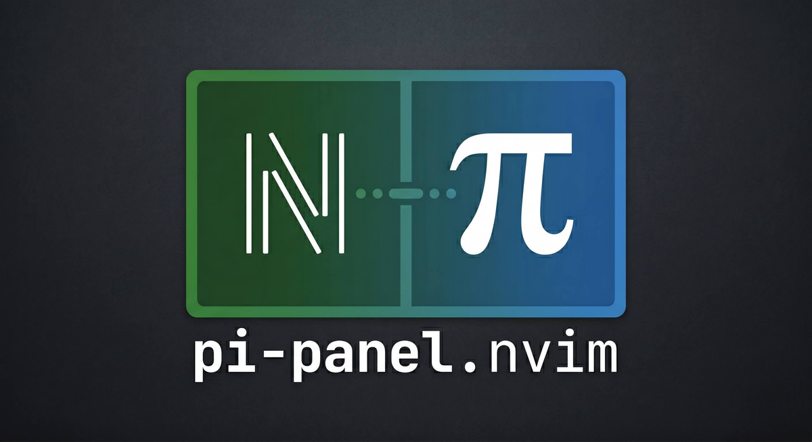

<div align="center">
  
</div>

# pi-panel.nvim

Deep [pi](https://github.com/earendil-works/pi) integration for Neovim: run
pi's full TUI in a side panel, with a WebSocket side channel that lets pi call
back into the editor — open files, review diffs, read your selection, fetch
diagnostics, and more.

## How it works

- pi runs with its normal TUI inside a Neovim terminal panel.
- Neovim hosts a small WebSocket server (pure Lua, localhost only) on a random
  port and writes a lock file to `~/.pi/ide/`.
- A bundled pi extension (`pi-nvim-bridge`) connects back to that server and
  registers tools that delegate to Neovim over JSON-RPC 2.0.
- Discovery is via `PI_IDE_PORT` / `PI_IDE_AUTH` environment variables that
  Neovim sets when it launches pi with `pi -e <bundled-extension>`.

## Requirements

- Neovim **0.10+** (`vim.uv`)
- [pi](https://github.com/earendil-works/pi) on your `PATH` (Node.js 18+)
- [snacks.nvim](https://github.com/folke/snacks.nvim) (optional; a native
  terminal fallback is used when it's absent)

No build step for end users — the extension ships as a committed, self-contained
bundle.

## Install

With [lazy.nvim](https://github.com/folke/lazy.nvim):

```lua
{
  "fonnesbeck/pi-panel.nvim",
  dependencies = { "folke/snacks.nvim" },
  opts = {},
}
```

`opts = {}` (or `config = true`) runs `setup()` with the defaults below.

## Configuration

```lua
require("pi-panel").setup({
  auto_start = true,              -- start the server + launch pi on setup
  pi_cmd = nil,                   -- nil => "pi" from PATH
  env = {},                       -- extra env vars for the pi process

  terminal = {
    provider = "auto",            -- "auto" | "snacks" | "native"
    split_side = "right",         -- "left" | "right"
    split_width_percentage = 0.30,
    auto_close = true,            -- close the panel when pi exits
    snacks_win_opts = {},
  },

  track_selection = true,         -- broadcast selection_changed notifications
  visual_demotion_delay_ms = 50,  -- selection-tracking debounce

  connection_timeout = 10000,
  reconnect_max_delay = 30000,

  diff_opts = {
    layout = "vertical",          -- "vertical" | "horizontal"
    open_in_new_tab = false,
    keep_terminal_focus = false,
    timeout = 300,                -- seconds before a diff auto-rejects
  },

  whichkey = { enabled = true, leader = "p" },
})
```

## Commands

| Command | Description |
|---------|-------------|
| `:Pi` | Toggle the pi panel |
| `:PiFocus` | Focus the panel (open if needed) |
| `:PiStart` | Start the server and launch pi |
| `:PiStop` | Stop pi and the server |
| `:PiReconnect` | Restart the server + pi to force reconnection |
| `:PiStatus` | Show connection status |
| `:PiSend` | Send the visual selection into pi's prompt |
| `:PiAdd [file]` | Send an `@file` mention (defaults to the current buffer) |
| `:PiAccept` | Accept the current diff |
| `:PiReject` | Reject the current diff |

## Keymaps (which-key)

When [which-key](https://github.com/folke/which-key.nvim) is installed, a
`<leader>p` group is registered:

| Key | Action |
|-----|--------|
| `<leader>pp` | Toggle panel |
| `<leader>pf` | Focus panel |
| `<leader>ps` | Send selection (visual) |
| `<leader>pa` | Accept diff |
| `<leader>pr` | Reject diff |
| `<leader>pb` | Add current buffer |
| `<leader>px` | Stop pi |

## Statusline

```lua
-- lualine example
{ function() return require("pi-panel.status").statusline() end }
```

Shows `pi: off` / `pi: waiting` / `pi: connected`.

## Tools available to pi

`nvim_open_file`, `nvim_open_diff`, `nvim_get_selection`,
`nvim_get_latest_selection`, `nvim_get_workspace_folders`,
`nvim_get_open_editors`, `nvim_get_diagnostics`, `nvim_check_dirty`,
`nvim_save_document`, `nvim_close_tab`, `nvim_close_all_diff_tabs`.

`nvim_open_diff` is blocking: pi proposes changes, you review them in a native
diff and accept (`:PiAccept` / `<leader>pa` / `:w`) or reject (`:PiReject` /
`<leader>pr`). Pressing Esc in pi cancels the review; an unreviewed diff
auto-rejects after `diff_opts.timeout` seconds.

## Development

```sh
make deps        # npm install for the extension (contributors only)
make build       # esbuild bundle -> extensions/pi-nvim-bridge/dist/index.js
make typecheck   # tsc --noEmit
make test        # Lua suite (nvim --headless) + extension tests (node:test)
make lint        # stylua --check (if installed)
```

The extension bundle (`dist/index.js`) is committed, so end users never build.
Run `make build` after changing the TypeScript source.

## License

[MIT](LICENSE)
